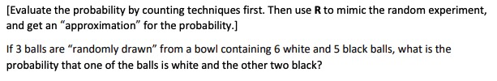
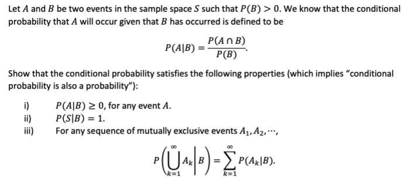
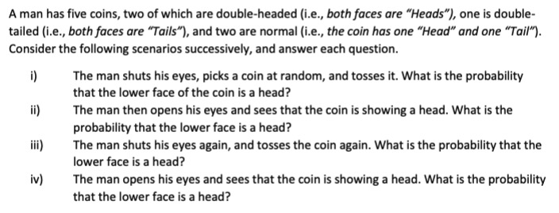
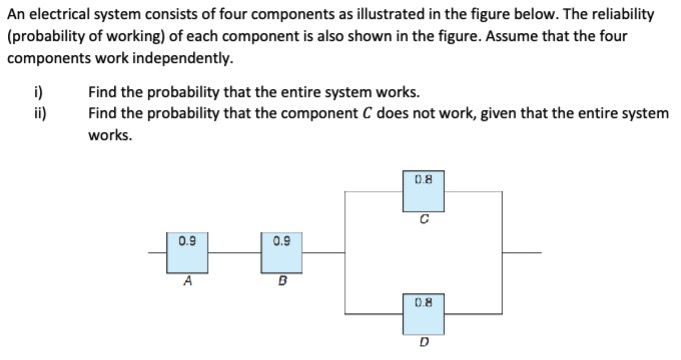

```{r setup, include = FALSE}
knitr::opts_chunk$set(
  collapse = TRUE,
  results = "asis",
  echo = TRUE,
  comment = "#>",
  out.width = "100%"
)
library(xaringanthemer)
```

```{r xaringan-themer, include=FALSE, warning=FALSE}
style_mono_accent(
  header_font_google = google_font("Josefin Slab", "600"),
  text_font_google   = google_font("Work Sans", "300", "300i"),
  code_font_google   = google_font("IBM Plex Mono")
)

style_mono_light(
  base_color = "#003366",
  link_color = "#996600",
  text_bold_color = "#996600",
  link_decoration = "underline"
)
```

```{r xaringan-panelset, echo=FALSE}
xaringanExtra::use_panelset()
```

class: inverse, center, middle

# Counting and Operations Principles

---

## Counting and operations principles

1. **Event:**
   - $A$
   - $A^c$ — the Complement of an event $A$;
   - $\emptyset$ — the Empty Set;
   - $S$ — the whole Sample Space

--

2. **Intersection of Events:** $A \cap B$

3. **Union of Events:** $A \cup B$

--

4. **Associative Law:**
   - $A \cup (B \cup C) = (A \cup B) \cup C$
   - $A \cap (B \cap C) = (A \cap B) \cap C$

5. **Distributive Law:**
   - $A \cap (B \cup C) = (A \cap B) \cup (A \cap C)$
   - $A \cup (B \cap C) = (A \cup B) \cap (A \cup C)$
   
---

## Counting and operations principles

6. **De Morgan’s Law:**  $(A \cup B)^c = A^c \cap B^c$, $(A \cap B)^c = A^c \cup B^c$

--

7. For **any events** $A$, $B$, and $C$:
   
  $$\begin{align*}
    P(A \cup B) = & P(A) + P(B) - P(A \cap B) \\
    P(A \cup B \cup C) = & P(A) + P(B) + P(C) \\
      & - P(A \cap B) - P(B \cap C) - P(C \cap A) \\
      & + P(A \cap B \cap C)
  \end{align*}$$
  
  We can calculate the probability of $P(A_1 \cup A_2 \cup A_3 \cup \cdots \cup A_n)$ by induction ([inclusion–exclusion principle](https://en.wikipedia.org/wiki/Inclusion%E2%80%93exclusion_principle)).
  
--

8. If events $A$, $B$, and $C$ are **mutually exclusive**, then 
  $$P(A \cup B \cup C) = P(A) + P(B) + P(C).$$

   How about the probability of the union of an event family, say, $P(A_1 \cup A_2 \cup A_3 \cup \cdots \cup A_n)$ which has mutually exclusive members?
   
---

## Counting and operations principles

9. If $A$ and $B$ are collectively exhaustive, then $P(A \cup B) = 1$, i.e., one of them must occur.

--

10. **The Factorial Notation:** $n! = n \cdot (n - 1) \cdot (n - 2) \cdots 3 \cdot 2 \cdot 1$.  
    While $0! = 1$ by convention.

--

11. Number of permutations of $r$ different objects taken from a given set of size $n$. Denote by $r$-permutations of $n$.

    $$P(n, r) = \frac{n!}{(n - r)!} = n \cdot (n - 1) \cdot (n - 2) \cdots (n - r + 1)$$

--

12. Number of combinations of $r$ different objects taken from a given set of size $n$. Denote by $r$-combinations of $n$.

    $$C(n, r) = \frac{n!}{(n-r)!r!} = \binom{n}{r}$$
    
    **Remark**: [number of ordered samples: $P(n, r)$] = [number of unordered samples] $\times$ [number of ways to order each sample $r!$]
    
---

## Problem 1

```{r out.width='95%', fig.align='center', echo=FALSE}

```

```{r}
set.seed(20240923)
# Use 0 to denote white and 1 to denote black
all_balls <- c(rep(0, 6), rep(1, 5)) # 6 white balls and 5 black balls
n_rep <- 1000 # repeat the experiment 1000 times
n_success <- 0 # count the number of successes (one of the balls is white and the other two black)
for (i in 1:n_rep) {
  sample_balls <- sample(x = all_balls, size = 3) # randomly draw 3 balls
  # cat("The sample balls are: ", sample_balls, "\n")
  if(sum(sample_balls) == 2) { # indicates that one of the balls is white and the other two black
    n_success <- n_success + 1
  }
}
n_success / n_rep
```
    
---
class: inverse, center, middle

# Conditional Probability

---

## Conditional probability

1. Let $A$ and $B$ be two events in a sample space $S$ with $P(B) > 0$. The **conditional probability** of $A$ given $B$ is defined as:

   $$P(A \mid B) = \frac{P(A \cap B)}{P(B)}$$

--

2. Let $A$ and $B$ be two events in a sample space $S$. $A$ and $B$ are called **independent** if $P(A \cap B) = P(A)P(B)$.

--

3. Let $B_1, B_2, \ldots, B_n$ be a partition (both **exhaustive** and **mutually exclusive**) of the sample space $S$ such that $P(B_i) \neq 0$ for all $B_i$. Then for any event $A$:

   $$P(A) = \sum_{i=1}^{n} P(A \cap B_i) = \sum_{i=1}^{n} P(A \mid B_i) P(B_i) \quad \text{(Law of total probability)}$$

   $$P(B_i \mid A) = \frac{P(A \mid B_i) P(B_i)}{P(A)} = \frac{P(A \mid B_i) P(B_i)}{\sum_{j=1}^{n} P(A \mid B_j) P(B_j)} \quad \text{(Bayes' Theorem)}$$
   
---

## Problem 2

```{r out.width='95%', fig.align='center', echo=FALSE}

```


---

## Problem 3

```{r out.width='95%', fig.align='center', echo=FALSE}

```

---

## Problem 4

```{r out.width='95%', fig.align='center', echo=FALSE}

```

---
class: inverse, center, middle

# Thank you!

Slides created via Yihui Xie's R package [**xaringan**](https://github.com/yihui/xaringan).

Theme customized via Garrick Aden-Buie's R package [**xaringanthemer**](https://github.com/gadenbuie/xaringanthemer).

Tabbed panels created via Garrick Aden-Buie's R package [**xaringanExtra**](https://github.com/gadenbuie/xaringanExtra/).

The chakra comes from [remark.js](https://remarkjs.com), [**knitr**](https://yihui.org/knitr/), and [R Markdown](https://rmarkdown.rstudio.com).