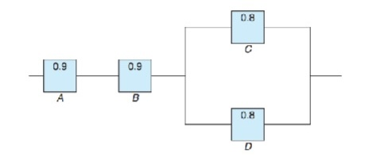

```{r setup, include = FALSE}
knitr::opts_chunk$set(
  collapse = TRUE,
  results = "asis",
  echo = TRUE,
  comment = "#>",
  out.width = "100%"
)
library(xaringanthemer)
```

```{r xaringan-themer, include=FALSE, warning=FALSE}
style_mono_accent(
  header_font_google = google_font("Josefin Slab", "600"),
  text_font_google   = google_font("Work Sans", "300", "300i"),
  code_font_google   = google_font("IBM Plex Mono")
)

style_mono_light(
  base_color = "#003366",
  link_color = "#996600",
  text_bold_color = "#996600",
  link_decoration = "underline"
)
```

```{r xaringan-panelset, echo=FALSE}
xaringanExtra::use_panelset()
```

class: inverse, center, middle

# Sample space, events, and probability

---

## Sample space, events, and probability

1. **Event:**
   - $A$
   - $A^c$ — the Complement of an event $A$;
   - $\emptyset$ — the Empty Set;
   - $S$ — the whole Sample Space

--

2. **Intersection of Events:** $A \cap B$

3. **Union of Events:** $A \cup B$

--

4. **Associative Law:**
   - $A \cup (B \cup C) = (A \cup B) \cup C$
   - $A \cap (B \cap C) = (A \cap B) \cap C$

5. **Distributive Law:**
   - $A \cap (B \cup C) = (A \cap B) \cup (A \cap C)$
   - $A \cup (B \cap C) = (A \cup B) \cap (A \cup C)$
   
---

## Sample space, events, and probability

6. **De Morgan’s Law:**  $(A \cup B)^c = A^c \cap B^c$, $(A \cap B)^c = A^c \cup B^c$

--

7. For **any events** $A$, $B$, and $C$:
   
  $$\begin{align*}
    P(A \cup B) = & P(A) + P(B) - P(A \cap B) \\
    P(A \cup B \cup C) = & P(A) + P(B) + P(C) \\
      & - P(A \cap B) - P(B \cap C) - P(C \cap A) \\
      & + P(A \cap B \cap C)
  \end{align*}$$
  
  We can calculate the probability of $P(A_1 \cup A_2 \cup A_3 \cup \cdots \cup A_n)$ by induction ([inclusion–exclusion principle](https://en.wikipedia.org/wiki/Inclusion%E2%80%93exclusion_principle)).
  
--

8. If events $A$, $B$, and $C$ are **mutually exclusive**, then 
  $$P(A \cup B \cup C) = P(A) + P(B) + P(C).$$

   How about the probability of the union of an event family, say, $P(A_1 \cup A_2 \cup A_3 \cup \cdots \cup A_n)$ which has mutually exclusive members?

---

### Problem 1.1

For any events $A$, $B$, $C$, show that
$$P((A \cup B) | C) = P(A | C) + P(B | C) - P((A \cap B) | C)$$

  **Proof** 
    $$\begin{align*}
      P((A \cup B) | C) = &\frac{P((A \cup B) \cap C)}{P(C)}, \\
      P((A \cup B) \cap C) = &P((A \cap C) \cup (B \cap C))  \\
      = &P(A \cap C) + P(B \cap C) - P(A \cap B \cap C), \\
      P((A \cup B) | C) = &\frac{P(A \cap C)}{P(C)} + \frac{P(B \cap C)}{P(C)} - \frac{P(A \cap B \cap C)}{P(C)}  \\
      = &P(A | C) + P(B | C) - P((A \cap B) | C).
    \end{align*}$$

---

### Problem 1.2

For any events $A$, $B$, $C$, show that
$$\begin{align*}
P(A \cup B \cup C) = & P(A) + P(B) + P(C) \\
& - P(A \cap B) - P(A \cap C) - P(B \cap C) \\
& + P(A \cap B \cap C)
\end{align*}$$

  **Proof:**
  $$\begin{align*}
    P(A \cup B \cup C) = &P((A \cup B) \cup C) \\
    = & P(A \cup B) + P(C) - P((A \cup B) \cap C) \\
    = & P(A) + P(B) - P(A \cap B) + P(C) \\
    & - P((A \cap C) \cup (B \cap C)) \\
    = & P(A) + P(B) + P(C) \\
    & - P(A \cap B) - P(A \cap C) - P(B \cap C) \\
    & + P(A \cap B \cap C)
\end{align*}$$

---
class: inverse, center, middle

# Counting techniques

---

## Counting and operations principles

9. If $A$ and $B$ are collectively exhaustive, then $P(A \cup B) = 1$, i.e., one of them must occur.

--

10. **The Factorial Notation:** $n! = n \cdot (n - 1) \cdot (n - 2) \cdots 3 \cdot 2 \cdot 1$.  
    While $0! = 1$ by convention.

--

11. Number of permutations of $r$ different objects taken from a given set of size $n$. Denote by $r$-permutations of $n$.

    $$P(n, r) = \frac{n!}{(n - r)!} = n \cdot (n - 1) \cdot (n - 2) \cdots (n - r + 1)$$

--

12. Number of combinations of $r$ different objects taken from a given set of size $n$. Denote by $r$-combinations of $n$.

    $$C(n, r) = \frac{n!}{(n-r)!r!} = \binom{n}{r}$$
    
    **Remark**: [number of ordered samples: $P(n, r)$] = [number of unordered samples] $\times$ [number of ways to order each sample $r!$]
    
---

### Problem 2.1

[Evaluate the probability by counting techniques first. Then use `R` to mimic the random experiment, and get an "approximation" for the probability.]

If $3$ balls are "randomly drawn" from a bowl containing $6$ white and $5$ black balls, what is the probability that one of the balls is white and the other two black?

--

  **Solution** $$\frac{C(6,1)C(5,2)}{C(6+5,3)}$$

--

  **Solution** We can also consider the order of the balls: 
  $$\frac{C(6,1)C(5,2)P(3,3)}{P(6+5,3)}$$

---

### Experiments

```{r}
set.seed(20240923)
# Use 0 to denote white and 1 to denote black
all_balls <- c(rep(0, 6), rep(1, 5)) # 6 white balls and 5 black balls
n_rep <- 1000 # repeat the experiment 1000 times
n_success <- 0 # count the number of successes (one of the balls is white and the other two black)
for (i in 1:n_rep) {
  sample_balls <- sample(x = all_balls, size = 3) # randomly draw 3 balls
  # cat("The sample balls are: ", sample_balls, "\n")
  if(sum(sample_balls) == 2) { # indicates that one of the balls is white and the other two black
    n_success <- n_success + 1
  }
}
n_success / n_rep
```
    
---
class: inverse, center, middle

# Conditional probability

---

## Conditional probability

1. Let $A$ and $B$ be two events in a sample space $S$ with $P(B) > 0$. The **conditional probability** of $A$ given $B$ is defined as:

   $$P(A \mid B) = \frac{P(A \cap B)}{P(B)}$$

--

2. Let $B_1, B_2, \ldots, B_n$ be a partition (both **exhaustive** and **mutually exclusive**) of the sample space $S$ such that $P(B_i) \neq 0$ for all $B_i$. Then for any event $A$:
$$P(A) = \sum_{i=1}^{n} P(A \cap B_i) = \sum_{i=1}^{n} P(A \mid B_i) P(B_i) \quad \text{(Law of total probability)}$$
$$P(B_i \mid A) = \frac{P(A \mid B_i) P(B_i)}{P(A)} = \frac{P(A \mid B_i) P(B_i)}{\sum_{j=1}^{n} P(A \mid B_j) P(B_j)} \quad \text{(Bayes' Theorem)}$$

---

### Problem 3.1

i) Let $A$ and $B$ be two events such that $P(A) = \frac{1}{2}$ and $P(B) = \frac{2}{3}$. If $P(A \cup B) = \frac{5}{6}$, then what is the probability that both $A$ and $B$ occur?

--

  **Solution**
  Given that $P(A) = \frac{1}{2}$, $P(B) = \frac{2}{3}$, $P(A \cup B) = \frac{5}{6}$, we have:
  $$P(A \cup B) = P(A) + P(B) - P(A \cap B)$$
  $$P(A \cap B) = P(A) + P(B) - P(A \cup B) = \frac{1}{2} + \frac{2}{3} - \frac{5}{6} = \frac{1}{3}$$

--

ii) What is the probability that $A$ occurs conditioned on that event $B$ already occurs?

--
  
  **Solution** 
  $$P(A \mid B) = \frac{P(A \cap B)}{P(B)} = \frac{1}{3} \div \frac{2}{3} = \frac{1}{2}$$

---

### Problem 3.2

A student takes a multiple choice examination where each question has 5 possible answers: A, B, C, D, E. The student works a question correctly if she knows the answer. If she does not know the answer, she picks a letter randomly among the five possible letters. Suppose the student knows the answer to 70% of the questions.

i) What is the probability that on a question chosen at random, the student gets the answer correctly?

--

  **Solution** 
  $$\begin{align*}
  P(\text{correct}) = & P(\text{correct} \mid \text{knows the answer}) \times P(\text{knows the answer}) \\
  & + P(\text{correct} \mid \text{does not know the answer}) \\
  & \times P(\text{does not know the answer}) \\
  = & 1 \times 0.7 + 0.2 \times 0.3 = 0.76.
  \end{align*}$$

---

### Problem 3.2

ii) Given that the student got the correct answer to this question chosen at random, what is the probability that she actually did not know the answer?

--

  **Solution** 
  $$\begin{align*}
  & P(\text{did not know the answer} \mid \text{correct}) \\
  = & \frac{P(\text{did not know the answer} \cap \text{correct})}{P(\text{correct})} \\
  = & \frac{0.3 \times 0.2}{0.76}.
  \end{align*}$$

---

### Problem 3.3

I have two pockets. There are 3 red balls and 4 blue balls in the first pocket. In the second pocket, there are 4 red balls and 3 blue balls. Suppose that I pick up one ball randomly from the first pocket and put it into my second pocket. Then I pick up one ball randomly from my second pocket.

i) The probability of the first selected ball (from the first pocket) is red ?

--

  **Solution** 
  $$P(\text{the first ball is red}) = \frac{3}{3+4} = \frac{3}{7}$$

---

### Problem 3.3

ii) The probability of the second selected ball (from the second pocket) is red ?

--

  **Solution** 
  $$\begin{align*}
  & P(\text{the second ball is red}) \\
  = & P(\text{the second ball is red} \cap \text{the first ball is red}) \\
  & + P(\text{the second ball is red} \cap \text{the first ball is blue}) \\
  = & P(\text{the second ball is red} \mid \text{the first ball is red}) P(\text{the first ball is red}) \\
  & + P(\text{the second ball is red} \mid \text{the first ball is red}) P(\text{the first ball is blue}) \\
  = & \frac{4+1}{4+3+1} \times \frac{3}{3+4} + \frac{4}{4+3+1} \times \frac{4}{3+4} = \frac{31}{56}.
  \end{align*}$$

---

### Problem 3.3

iii) Conditioned on that the second ball is red, what is the probability that the first ball is red?

--

  **Solution** 
  $$\begin{align*}
  & P(\text{first ball is red} \mid \text{second ball is red}) \\
  = & \frac{P(\text{the first ball is red} \cap \text{the second ball is red})}{P(\text{the second ball is red})} \\
  = & \frac{P(\text{the second ball is red} \mid \text{the first ball is red}) P(\text{the first ball is red})}{P(\text{the second ball is red})} \\
  = & \frac{\frac{4+1}{4+3+1} \times \frac{3}{3+4}}{\frac{31}{56}} = \frac{15}{31}.
  \end{align*}$$

---

### Problem 3.4

There is a 50-50 chance that the queen carries the gene of hemophilia. If she is a carrier, then each prince has a 50-50 chance of having hemophilia independently. If the queen is not a carrier, the prince will not have the disease. Suppose the queen has had three princes. 

What is the probability the queen is a carrier?

--

  **Solution**
  $$\begin{align*}
  & P(\text{carrier} | \text{three healthy princes}) \\
  = & \frac{P(\text{carrier} \cap \text{three healthy princes})}{P(\text{three healthy princes})} \\
  = & \frac{P(\text{three healthy princes} | \text{carrier}) \cdot P(\text{carrier})}{P(\text{three healthy princes})}
  \end{align*}$$

---

### Problem 3.4

  **Solution**
  We have known that:
  $$P(\text{carrier}) = \frac{1}{2}, \quad P(\text{three healthy princes} | \text{carrier}) = (\frac{1}{2})^3 = \frac{1}{8}.$$
  The marginal probability is:
  $$\begin{align*}
  & P(\text{three healthy princes}) \\
  = & P(\text{three healthy princes} \mid \text{carrier}) \cdot P(\text{carrier}) \\
  & + P(\text{three healthy princes} \mid \text{not carrier}) \cdot P(\text{not carrier}) \\
  = & \frac{1}{8} \cdot \frac{1}{2} + 1 \cdot \frac{1}{2} = \frac{9}{16}.
  \end{align*}$$
  
  Therefore,
  $$\begin{align*}
  P(\text{carrier} | \text{three healthy princes}) = \frac{\frac{1}{8} \cdot \frac{1}{2}}{\frac{9}{16}} = \frac{1}{9}
  \end{align*}$$

---

### Problem 3.5

Let $A$ and $B$ be two events in the sample space $S$ such that $P(B) > 0$. We know that the conditional probability that $A$ will occur given that $B$ has occurred is defined to be

$$P(A | B) = \frac{P(A \cap B)}{P(B)}.$$

Show that the conditional probability satisfies the following properties (which implies "conditional probability is also a probability"):

i) $P(A | B) \geq 0$, for any event $A$.  

ii) $P(S | B) = 1$.  

iii) For any sequence of mutually exclusive events $A_1, A_2, \ldots$,

$$P\left(\bigcup_{k=1}^{\infty} A_k \mid B\right) = \sum_{k=1}^{\infty} P(A_k | B).$$


---

### Problem 3.6

A man has five coins, two of which are double-headed (i.e., both faces are "Heads"), one is double-tailed (i.e., both faces are "Tails"), and two are normal (i.e., the coin has one "Head" and one "Tail"). Consider the following scenarios successively, and answer each question.

i) The man shuts his eyes, picks a coin at random, and tosses it. What is the probability that the lower face of the coin is a head?

ii) The man then opens his eyes and sees that the coin is showing a head. What is the probability that the lower face is a head?

iii) The man shuts his eyes again, and tosses the coin again. What is the probability that the lower face is a head?

iv) The man opens his eyes and sees that the coin is showing a head. What is the probability that the lower face is a head?

---
class: inverse, center, middle

# Idenpendence

---

## Independence

--

1. **Definition**: Let $A$ and $B$ be two events in a sample space $S$. $A$ and $B$ are called **independent** if $P(A \cap B) = P(A)P(B)$.

--

2. The following statements are equivalent:

    * $A$ and $B$ are **independent**.

    * $P(A \mid B) = P(A)$, $P(B \mid A) = P(B)$.
    
    * $P(A \cap B) = P(A \mid B) P(B) = P(B \mid A) P(A) = P(A)P(B)$.
    
--

3. The following statements are also equivalent:

    * $A$ and $B$ are **independent**.
    
    * $A$ and $B^c$ are **independent**.
    
    * $A^c$ and $B$ are **independent**.
    
    * $A^c$ and $B^c$ are **independent**.

---

### Problem 4.1

A town has two fire engines operating independently. The probability that a specific engine is available when needed is $0.96$.

i) What is the probability that neither is available when needed?

--

  **Solution**
  Let $P(A_1) = 0.96$ and $P(A_2) = 0.96$ be the probabilities that engines 1 and 2 are available, respectively.
  Then the probability that an engine is not available is:
  $$P(A_1^c) = 0.04, \quad P(A_2^c) = 0.04$$
  The probability that neither is available is:
  $$P(A_1^c) \cdot P(A_2^c) = 0.04 \times 0.04 = 0.0016$$

--

ii) What is the probability that only one fire engine is available when needed?

--

  **Solution** 
  The probability that only one is available is:
  $$P(A_1) \cdot P(A_2^c) + P(A_1^c) \cdot P(A_2) = 0.96 \times 0.04 + 0.04 \times 0.96 = 0.0768$$

---

### Problem 4.2

Let $A$ and $B$ be two independent events such that $P(A) = \frac{2}{7}$ and $P(B) = \frac{1}{4}$. Find $P(A^c \cup B^c)$.

--

  **Solution**
  Given that $P(A) = \frac{2}{7}$ and $P(B) = \frac{1}{4}$, we have:
  $$P(A^c) = 1 - P(A) = \frac{5}{7}, \quad P(B^c) = 1 - P(B) = \frac{3}{4}.$$

  Since $A$ and $B$ are independent, we have:
  $$P(A^c \cap B^c) = P(A^c) \cdot P(B^c).$$

  Thus, the probability $P(A^c \cup B^c)$ is:
  $$P(A^c \cup B^c) = P(A^c) + P(B^c) - P(A^c \cap B^c) = \frac{5}{7} + \frac{3}{4} - \frac{5}{7} \times \frac{3}{4} = \frac{13}{14}$$

---

### Problem 4.3

An electrical system consists of four components as illustrated in the figure below. The reliability (probability of working) of each component is also shown in the figure. Assume that the four components work independently.

i) Find the probability that the entire system works.

ii) Find the probability that the component $C$ does not work, given that the entire system works.

```{r out.width='65%', fig.align='center', echo=FALSE}

```

---
class: inverse, center, middle

# Thank you!

Slides created via Yihui Xie's R package [**xaringan**](https://github.com/yihui/xaringan).

Theme customized via Garrick Aden-Buie's R package [**xaringanthemer**](https://github.com/gadenbuie/xaringanthemer).

Tabbed panels created via Garrick Aden-Buie's R package [**xaringanExtra**](https://github.com/gadenbuie/xaringanExtra/).

The chakra comes from [remark.js](https://remarkjs.com), [**knitr**](https://yihui.org/knitr/), and [R Markdown](https://rmarkdown.rstudio.com).